# My Cookbook - Recipe Blog

## Intro

For my fourth portfolio project, I created a blog app to display recipes to a user.  As a private chef, I often get asked by clients to share my recipes with them.  My Cookbook facilitates this as a recipe-sharing app that allows users to browse, search, and interact with recipes - without having to scroll through a lot of text first.


Visit the deployed site here: [My Cookbook](https://pp4-my-cookbook-blog-1667a6d7fc25.herokuapp.com/)

View My Cookbook on [Github](https://github.com/EJFleet/pp4-my-cookbook-blog)

For Admin access with relevant sign-in information: [My Cookbook Admin](https://pp4-my-cookbook-blog-1667a6d7fc25.herokuapp.com/admin/)

For the details of all testing carried out, please go to [TESTING.MD](docs/testing/TESTING.md)


---

* [User Experience (UX)](#user-experience-ux)
  * [User Stories](#user-stories)
  * [Design](#design)
    * [Planning](#planning)
    * [Imagery](#imagery)

* [Features](#features)
  * [Future Implementations](#future-implementations)

* [Project Management & Agile Methodologies](#project-management--agile-methodologies)
  * [Kanban Board](#kanban-board)
  * [MoSCoW Prioritisation](#moscow-prioritisation)

* [Technologies Used](#technologies-used)
  * [Languages](#languages)
  * [Frameworks, Libraries & Packages](#frameworks-libraries--packages)
  * [Tools](#tools)

* [Deployment & Local Development](#deployment--local-development)
  * [Forking the GitHub Repository](#forking-the-github-repository)
  * [Cloning the GitHub Repository](#cloning-the-github-repository)
  * [Deploying to Heroku](#deploying-to-heroku)

* [Credits](#credits)
  * [Code Inspiration](#code-inspiration)
  * [Acknowledgments](#acknowledgments)

---

## User Experience (UX)

The user experience (UX) for this project was designed with careful consideration of user needs and project goals, ensuring a seamless, intuitive, and engaging experience for all users. The planning process was informed by Agile methodologies and centered around user stories, categorized into epics to structure development priorities effectively.

<details>

<summary> Epics and User Stories screenshot </summary>


</details>

[Link to original document](https://docs.google.com/spreadsheets/d/1zJu0cbOBp-2E82P60fr14d2KqF_FlaW7Y0sWi2PrPls/edit?usp=sharing)

  ### User Stories

  #### Navigation

  As a user I can:
  - use a simple navigation menu so that easily find content.
  - view the navigation menu on any screen sizes so that navigating the site remains easy on all my devices.
  - easily find social media links so that I can find and interact with a community of app users.


  #### User Account

  As a Site User I can:
  - sign up for an account so that I can interact with site content by leaving comments.
  - easily sign in to my account so that I can easily use the site features on return visits.
  - easily log out of my account so that I can keep my account secure.

  As a Site Admin I can:
  - delete a User's account so that I can remove any inappropriate accounts.


  #### Recipe CRUD

    
  As a Staff Member I can:
  - create recipes so that I can share them on the site.
  - save a recipe as a draft so that I can make changes later.
  - publish and unpublish recipes so that I can choose whether to share the recipe or not.
  - update/edit recipes so that I can revise the recipe.
  - delete recipes so that I can remove the recipe from the site.


  #### Site Features

  As a Site User I can:
  - view a paginated list of recipes so that I can select one to read.
  - click on a recipe so that I can read the full recipe.
  - view a list of team members so that I can see who is behind the blog.
  - search for recipe so that I can find the relevant recipe for my needs.


  #### Comment CRUD

  As a Site User I can:
  - view a list of approved comments by registered users so that I can see tips and opinions on each recipe.
  
  As a logged-in Site User I can:
  - leave comments on a recipe so that I can be involved in the conversation.
  - see a notification that my comment is waiting for approval so that I know it has been sent.
  - see my comment displayed just in my view before it has been approved so that I can make any necessary changes.
  - edit my own comments so that I can correct any mistakes.
  - delete my own comments so that I can decide whether I want them to be public any more or not.

  As a Site Admin I can:
  - decide whether to approve or delete a User's comment so that no inappropriate content is displayed on my website.


  #### Team Members

  As a Site Admin I can:
  - create a new Team Member so that I can add a new member of staff as the team grows.
  - edit a Team Member so that I can keep content relevant if someone's details change.
  - delete a Team Member so that I can keep content relevant if somebody leaves. 


### Design

#### Planning

##### Structure

The Recipe Book app is designed with a simple structure to ensure the app is easy to use and navigate. Each page has a consistent layout to allow users to easily find the information they need. The app has a responsive design to ensure it can be clearly viewed on a wide range of devices. The navigation menu is available on all pages of the app to provide users with a consistent method to navigate the site. Bootstrap rows and columns have been used to provide a clean and uniform structure to the content of each page.

##### Wireframes

The wireframes that I originally designed have slightly different aesthetic differences to the finished product. During the construction process, I decided to change the format and layout of some of the features. The original wireframes are below - though the concept evolved, the original layout is still relevant and can be recognised in the finished site.

<details>

<summary> base.html - desktop and mobile </summary>


</details>

<details>

<summary> index.html - desktop and mobile -relevant for both the recipe list and the team page </summary>


</details>

<details>

<summary>recipe_detail.html - desktop</summary>


</details>

<details>

<summary>recipe_detail.html - mobile</summary>


</details>


#### Database Design

The database design for this project consists of the following models:
- **Recipe**: Represents individual recipes.
- **Comment**: Represents comments on recipes.
- **TeamMember**: Represents staff members contributing to the site.


### Database Evolution

The initial Entity Relationship Diagram (ERD) was created during the planning phase to represent the anticipated relationships between the models. However, as development progressed, certain requirements and challenges emerged that led to changes in the database structure. This is a common aspect of Agile development, allowing flexibility to adapt to new insights.

<details>

<summary> Current ERD  </summary>
  


</details>

<details>

<summary> Original ERD </summary>

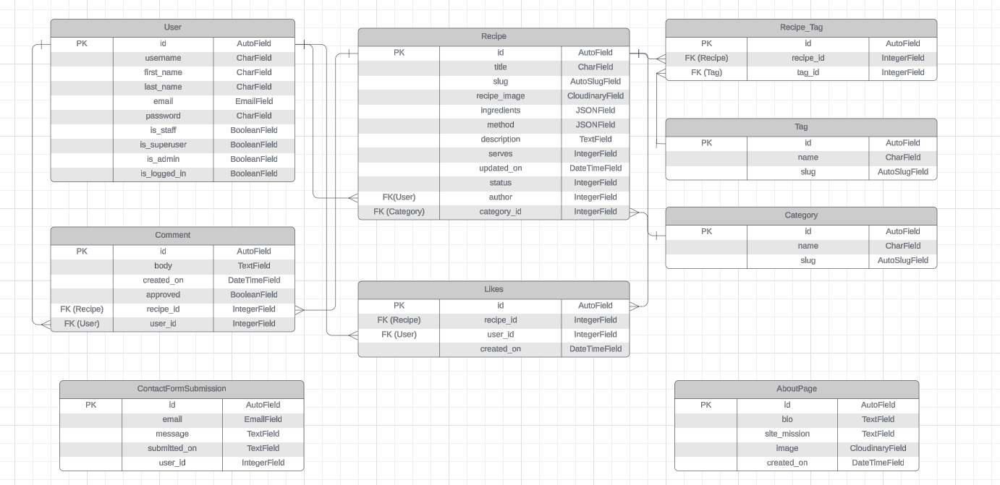

</details>


#### Colour Scheme

The colour scheme was chosen to give a fresh, clean look to the app that does not distract from the text and images of the recipes and to provide contrast for good readability of the information. The colour palette was created using [Coolors](https://coolors.co/).

<details>

<summary> Colour Palette  </summary>

  


</details>


#### Fonts
  
[Google Fonts](https://fonts.google.com/) was used to add the following fonts:

- 'Roboto' was used to provide a simple, clean and easy to read appearance.
- 'Nixie One' was used to give character to the logo. 


#### Imagery

- All images used for the recipes were taken from [BBC Good Food](https://bbcgoodfood.com) and [Recipe Tin Eats](https://recipetineats.com).
- All images used for the team members were downloaded for free from [Pexels](https://pexels.com)

  <details>

  <summary>Favicon was created using <a href="https://favicon.io">favicon.io</a></summary>
    
  

  </details>


---

## Features

### General Features

#### Navigation Bar

The site features a responsive navigation bar that is consistent across all pages.
<details>

<summary> Details </summary>
It includes links to the following pages:
- Home
- Register, Login/Logout (based on user authentication status)
- Meet the Team
- Add Recipe

It also includes:
- the app logo
- the app slogan of 'Recipes for Everyday Living'
- a search bar 

**Key Features**:
- Fixed to the top of the screen in all views to allow for easy navigation.
- Adjusts automatically for different screen sizes.
- On smaller screens, it collapses into a dropdown toggler for a cleaner and more user-friendly interface.

**Screenshots**:


</details>


---

#### Footer
The site displays a footer on all pages which is fully responsive at all screen sizes.

<details>

<summary> Details </summary>

It provides quick access to:
- Copyright information for the site.
- Social media links (Facebook, X, Instagram, YouTube).

**Key Features**:
- Social media icons open in a new tab when clicked.
- The footer is fully responsive and adjusts to fit any screen size.

**Screenshots**:


</details>

---
### Recipe Features

#### Recipe List View
The recipe list view displays all available recipes in a paginated format. Users can browse through the recipes to find one they are interested in.

<details>

<summary> Details </summary>

**Key Features**:
- Pagination: Limits the number of recipes displayed per page for better user experience.
- Each recipe card displays:
  - Recipe title
  - Thumbnail image
  - Short description
  - Date on which the recipe was posted
- Clicking on a recipe card redirects the user to the full recipe details page.
- If a user is not a logged-in Staff user, draft recipes are hidden from display.  Otherwise, drafts are shown with a faded effect.

**Screenshots**:

Desktop:


Mobile:


Example of draft recipe display (2nd from left):


</details>

---

#### Recipe Details
The recipe details page provides complete information about a selected recipe.

<details>

<summary> Details </summary>

**Key Features**:
- Displays:
  - Recipe title, description, servings, ingredients, and method.
  - Featured image (or placeholder if no image is provided).
  - Author and date of creation.
- Comment section below the recipe.
- Icon showing the comment count on the recipe.
- Comment form or a link to log in, depending on user status.

**Screenshots**:

Anonymous User (Desktop):


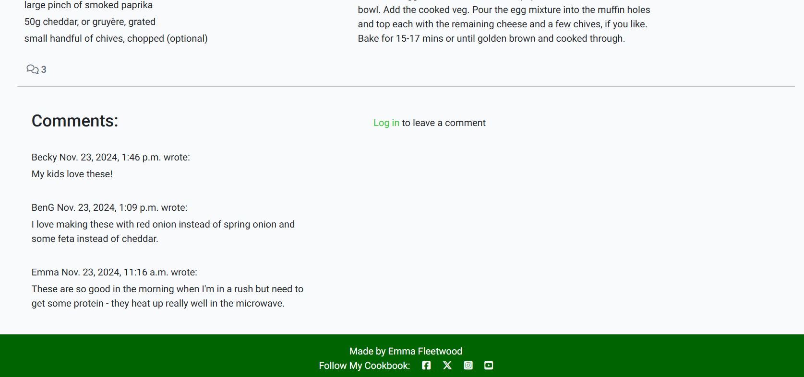

Logged-in Non-Staff User (Desktop):


Logged-in Staff User (Desktop):


Anonymous User (Mobile):


Logged-in Non-Staff User (Mobile):


Logged-in Staff User (Mobile):

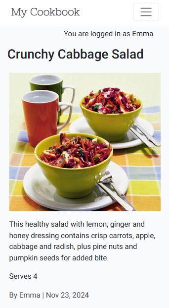


</details>

---

#### Recipe Management (Admin/Staff Only)
Staff and admin users can manage recipes directly from the site or the admin panel.

<details>

<summary> Details </summary>

**Key Features**:
- **Create Recipe**: Staff can create a new recipe with fields for title, description, ingredients, method, servings and image.
- **Save as Draft or Publish**: Recipes can be saved as drafts for future editing or published immediately.
- **Edit Recipe**: Staff can update any aspect of the recipe, including changing its status (draft or published).
- **Delete Recipe**: Staff can permanently delete a recipe.

**Screenshots**:

- Create Recipe Form: 


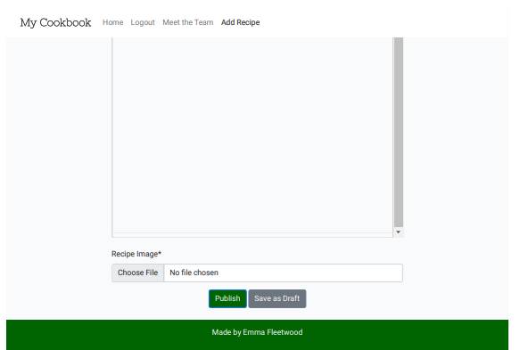

- Edit Recipe Form: 

This is the same as the form for creating a recipe, except that it is prepopulated with the recipe details.


- Delete Recipe Confirmation:

Before a staff/admin user deletes a recipe, a confirmation page is displayed with the option to continue with deletion or to cancel the action, which will take them back to the recipe page.

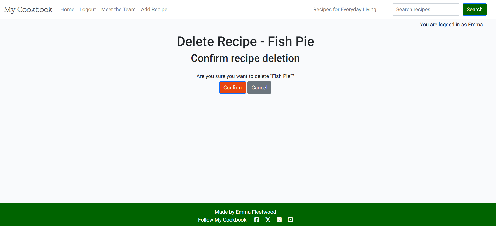


</details>

---
### Comments Features

#### Comment Section
Users can view comments left by others under each recipe. The comments section provides a way for users to interact and share their thoughts or tips about the recipe.

<details>

<summary> Details </summary>

**Key Features**:

- Comments are displayed in chronological order (newest first).

**Screenshots**:

Staff member:


Logged-in User (comment author):


Logged-in User (not comment author):


Anonymous User:


</details>

---

#### Add a Comment
Registered users can leave their own comments on recipes to share their feedback or suggestions.

<details>

<summary> Details </summary>

**Key Features**:

- A form allows users to enter their comments.
- Comments are submitted for admin approval before they become visible to others.
- The user is notified that their comment has been submitted and is waiting for approval.
- Pending comments display a notification to the user below the header that their comment is awaiting approval.

**Desktop**:


**Mobile**:


</details>

---

#### Edit/Delete Comments
Users have the ability to manage their own comments, while admins have extended privileges to moderate all comments.

<details>

<summary> Details </summary>

**Key Features**:

- **Users**:
  - Edit their own comments to fix errors or make updates.
  - Delete their own comments if they no longer want them displayed.
  - The form for editing comments is the same as the one for adding comments, with the comment populated in the form.

- **Admins**:
  - Delete comments submitted by any user to ensure content adheres to site guidelines.
  - Edit comments (admin only) for minor adjustments if needed.
  - Approve comments (admin only) so that only suitable comments are published.

**Desktop**:


**Mobile**:


**Admin Comments Panel**:


</details>

### **User Account Features**

#### **Registration**
Users can sign up for an account to access additional features such as leaving comments.

<details>

<summary> Details </summary>

**Key Features**:
- A registration form with fields for username, email, and password.
- Password validation to ensure security.

**Screenshots**:

Desktop:


Mobile:


</details>


---

#### **Login/Logout**

Users can securely log in and out of their accounts to maintain session integrity.

<details>

<summary> Details </summary>

**Key Features**:

- Login form that authenticates users using their credentials.
- A logout option available in the navigation bar when logged in.
- Login status displayed in the top right of the page under the navbar.
- Success messages displayed upon logging in or logging out.


**Screenshots**:

Desktop Login Form:

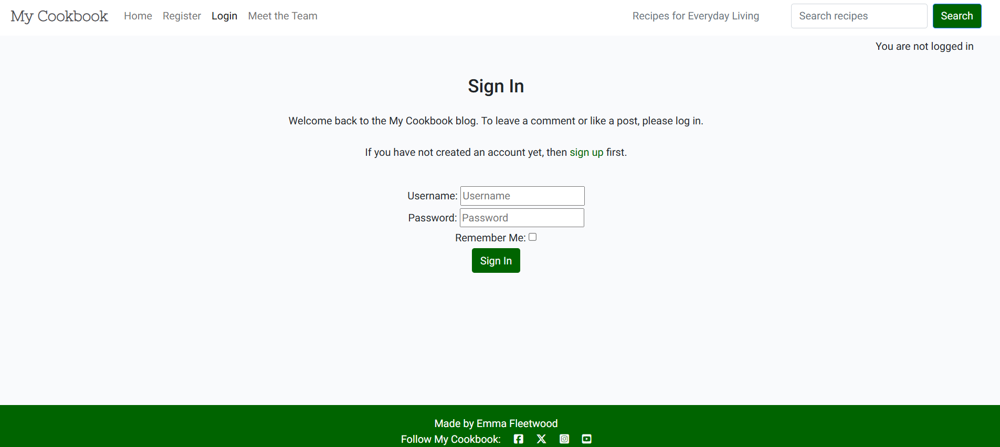

Mobile Login Form:

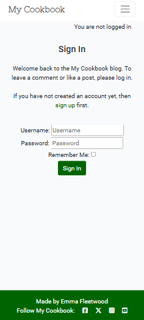

Desktop Logout Form:


Mobile Logout Form:


Desktop Logged-in Status:


Mobile Logged-out Status:


Login Confirmation:


Logout Confirmation:


</details>

---

#### **User Authentication Error Handling**

The application provides comprehensive error handling for user authentication processes, ensuring users receive clear feedback when encountering issues during login or sign-up.

<details>

<summary> Details </summary>

**Key Features**:

- **Incorrect Password on Login**: Users are shown an error message if they enter an incorrect password while trying to log in, ensuring they understand the issue.
- **Nonexistent Username on Login**: If a user attempts to log in with a username that doesn't exist, they are informed via an error message, maintaining clarity and security.
- **Non-original Username on Sign Up**: During sign-up, users attempting to register with a username that already exists receive an error message, enforcing unique usernames.
- **Unmatching Passwords on Sign Up**: The "password" and "confirm password" fields must match during sign-up; otherwise, an error message is displayed.
- **Too Short Password on Sign Up**: Passwords are validated for minimum length, and users entering too-short passwords are informed with an error message to enhance security.
- **Invalid Email Address on Sign Up**: The email field checks for valid formatting, ensuring users cannot register with improperly formatted email addresses.

**Screenshots**:

- **Error for Incorrect Password and/or Nonexistent Username on Login**:
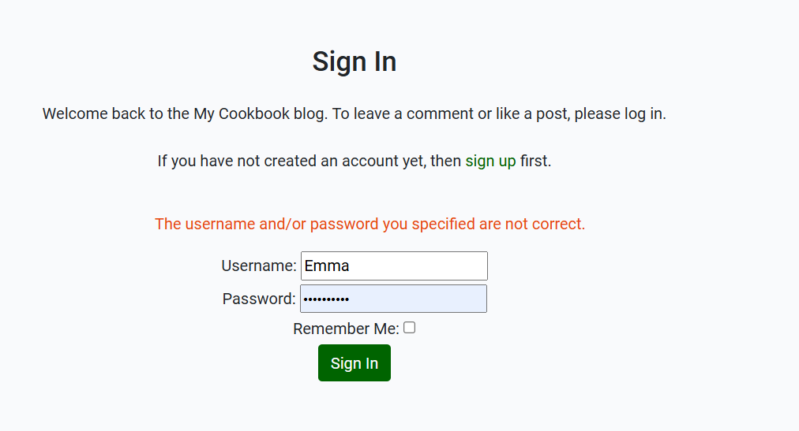

- **Error for Non-original Username on Sign Up**:
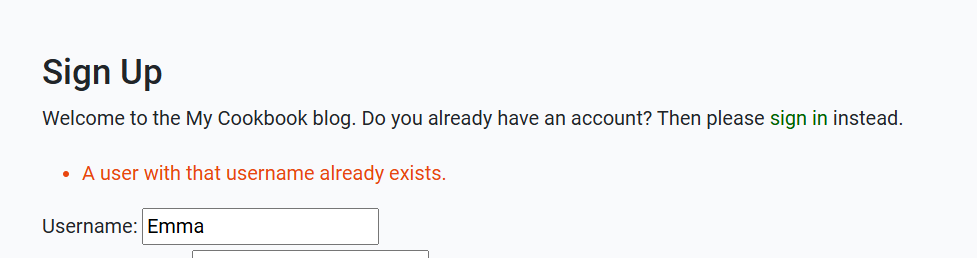

- **Error for Unmatching Passwords on Sign Up**:
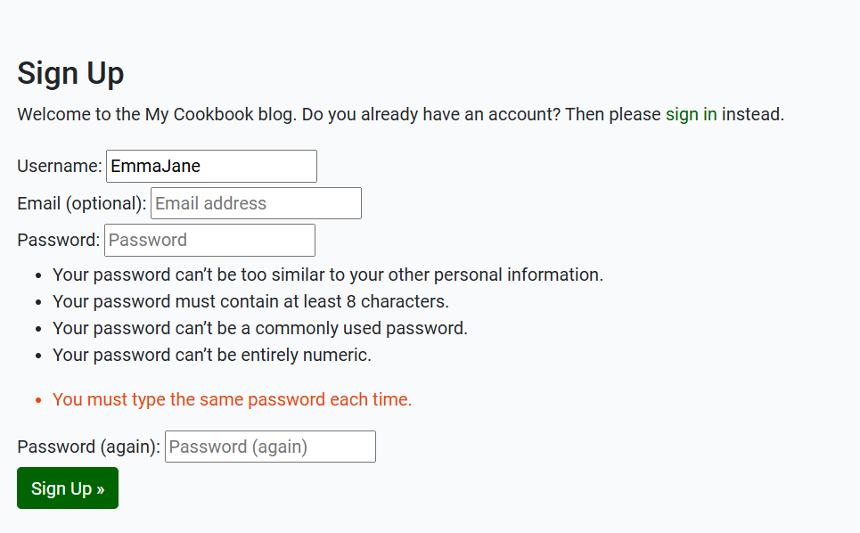

- **Error for Too Short Password on Sign Up**:
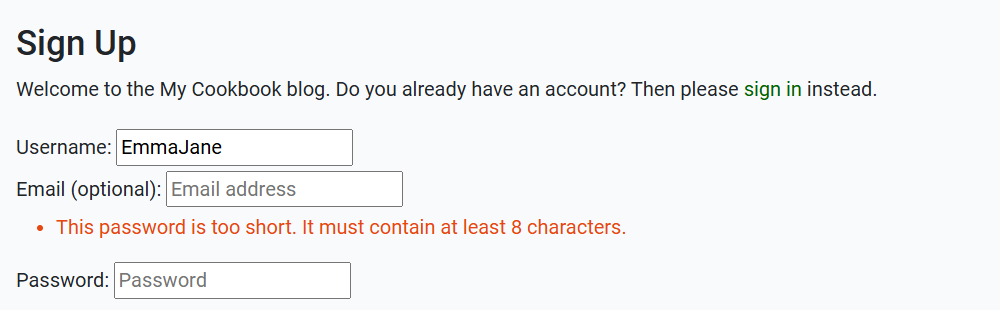

- **Error for Invalid Email Address on Sign Up**:
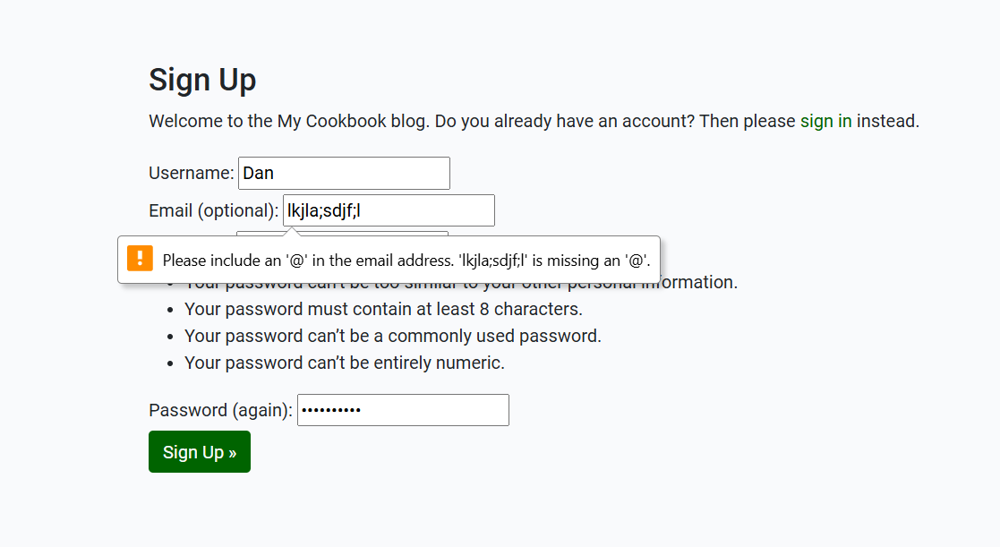

</details>

---


### **Admin/Staff-Specific Features**

#### **Admin Panel**
Admins can manage the site content directly from the Django admin panel.

<details>

<summary> Details </summary>

**Key Features**:
- Manage users, recipes, comments, and team members.
- View and filter data using the admin interface.
- Bulk actions like deleting multiple comments or recipes.

**Screenshots**:


</details>

---

#### **Staff Permissions**
Certain features are restricted to staff or admin users only.

<details>

<summary> Details </summary>

**Key Features**:
- Only staff can create, edit, and delete recipes.
- Only admins can approve or delete comments submitted by users.
- Only admins can add, update or delete a Team Member.


</details>

---

### **Team Member Features**

#### **Team Member Page**
Users can view a dedicated page showcasing the team behind the blog.

<details>

<summary> Details </summary>

**Key Features**:
- Each team member's profile includes their name, job title, bio, location, and image.
- Responsive layout that displays team members attractively on all devices.
- Pagination is applied for easy browsing if there are many team members.

**Screenshots**:

Desktop:


Mobile:


</details>

---

#### **Manage Team Members**
Admins can manage team member profiles through the admin panel.

<details>

<summary> Details </summary>

**Key Features**:
- Add a new team member with all required details.
- Edit existing team member profiles to keep information up to date.
- Delete team members no longer part of the blog.

**Screenshots**:


</details>

---

### **Search & Filtering**

#### **Search Recipes**
Users can search for recipes by keywords in their title, description, ingredients or method.

<details>

<summary> Details </summary>

**Key Features**:
- A search box available in the navigation bar on all pages.
- Results dynamically update based on the search query.
- Message displays with search box underneath if no results for search query

**Screenshots**:

Search box Desktop:


Search box Mobile:


Search results page for 'cake':


Zero search results:


</details>

---
### Error Pages

#### Custom Error Pages

The app provides user-friendly custom error pages for HTTP errors including `403 Forbidden`, `404 Not Found`, `405 Method Not Allowed`, and `500 Internal Server Error`. This ensures users are presented with clear and aesthetically pleasing error messages, maintaining a professional look even when something goes wrong.

<details>

<summary> Details </summary>

- **403 Forbidden**:
  - Displayed when a user attempts to access a restricted page or perform an unauthorized action.
  - Message: "You are not authorised to perform this action"
  
- **404 Not Found**:
  - Displayed when a user tries to access a page that does not exist.
  - Message: "Sorry, the page you are looking for does not exist."

- **405 Method Not Allowed**:
  - Displayed when a user tries to perform an HTTP method that is not supported by the server for a specific URL.
  - Message: "The method you are trying to use is not allowed on this page."

- **500 Internal Server Error**:
  - Displayed when an unexpected error occurs on the server.
  - Message: "Oops! Something went wrong on our end. Please try again later."

Each error page includes:
- A **consistent site layout** to keep users oriented.
- A **clear message** explaining the error.
- A **call-to-action link**, the "Go Back to Home" button, to help users navigate back to the main site.


- **403 Forbidden**
  

- **404 Not Found**
  

- **500 Internal Server Error**
  

</details>

---


### Future Implementations

  I would add the following features:
  * Like/remove like from a recipe and view how many likes a recipe had received from other users
  * Recipe categorisation and tagging to facilitate a more comprehensive search and filter experience
  * An 'About' page to explain what the site is about and who it is for
  * Contact Form to make it easier for user's to contact the site admin
  * A share function for a user to share a recipe on social media
  * Users can add a recipe to a 'favourites' folder

---
  
## Project Management & Agile Methodologies

### Agile Development

This project was developed using Agile methodology which allowed me to iteratively and incrementally build my app, with flexibility to make changes to my design throughout the entire development process.

#### Kanban Board

GitHub Issues and Projects were used to manage the development process. Each part of the app is divided into Epics which are broken down into User Stories with Tasks. An Epic represents a large body of work, such as a feature. The board view of the Project feature was used to display and manage my progress in the form of a 'kanban board'. The user stories were added to the 'Todo' column to be prioritised for development, moved to the 'In Progress' column to indicate development of the feature had begun and finally moved to the 'Done' column when the feature had been implemented and the acceptance criteria had been met.

<details>

  <summary> Kanban Board  </summary>

  

</details>

[The Project Kanban Board](https://github.com/users/EJFleet/projects/2)

#### MoSCoW Prioritisation

User stories were prioritised using the MoSCoW prioritisation technique. Each user story was given one of the following labels:

- Must have - to indicate the user story is guaranteed to be delivered.
- Should have - to indicate the user story would add significant value but is not vital.
- Could have - to indicate the user story would have a small impact if left out.
- Won't have - to indicate the user story is not a priority in the current iteration.

---

## Technologies Used


### Languages

- [HTML5](https://en.wikipedia.org/wiki/HTML5)
- [CSS3](https://en.wikipedia.org/wiki/CSS)
- [JavaScript](https://en.wikipedia.org/wiki/JavaScript)
- [Python](https://en.wikipedia.org/wiki/Python_(programming_language))


### Frameworks, Libraries & Packages
  
- [Django 4.2.16](https://docs.djangoproject.com/en/4.2/) - The main web framework used to build the application, creating models, views and templates.
- [Bootstrap 5](https://getbootstrap.com/) - front-end CSS framework for modern responsiveness and pre-built components
- [Font Awesome 5.15.4](https://fontawesome.com/) - social media icons in footer
- [Google Fonts](https://fonts.google.com/) - fonts used on the app
- [django-crispy-forms](https://django-crispy-forms.readthedocs.io/en/latest/) - enhanced form rendering with customizable styles and better integration with Bootstrap
- [cripsy-bootstrap5](https://github.com/django-crispy-forms/crispy-bootstrap5) - Bootstrap 5 styling support to `django-crispy-forms`
- [django-allauth](https://django-allauth.readthedocs.io/en/latest/) - user authentication, registration, and account management
- [Gunicorn](https://gunicorn.org/) - used for WSGI server
- [psycopg2](https://pypi.org/project/psycopg2/) - PostgreSQL adapter for Python, used to interact with the PostgreSQL database
- [django-summernote](https://summernote.org/) - WYSIWYG text editor integrated into Django admin and forms for creating rich-text content
- [cloudinary 1.36.0](https://cloudinary.com/) - managing and serving images using the Cloudinary API
- [whitenoise (5.3.0)](https://whitenoise.readthedocs.io/en/latest/) - serving static files in production


### Tools

- [Git](https://git-scm.com/) - version control
- [GitHub](https://github.com/) - save and store the files for the app
- [GitPod](https://gitpod.io/) - developing the app
- [Heroku](https://heroku.com/) - deploying the app
- [PostgreSQL](https://www.postgresql.org/) - database
- [Cloudinary](https://cloudinary.com/) - storing images
- [Balsamiq](https://balsamiq.com/) - wireframes
- [Lucid.app](lucid.app) - creating the ERD
- [Coolors](https://coolors.co/) - colour scheme
- [Am I Responsive](https://ui.dev/amiresponsive) -responsive screenshots
- [favicon.io](https://favicon.io/) - custom favicon
- [FontAwesome](https://fontawesome.com/) - social media icons in footer
- [ChatGPT](https://chatgpt.com/) - debugging and formatting
- [The W3C Markup Validation Service](https://validator.w3.org/) - validating HTML
- [The W3C CSS Validation Service](https://jigsaw.w3.org/css-validator/) - validating CSS
- [Code Insitute PEP8 Validator](https://pep8ci.herokuapp.com/#) - validating the Python code
- [JSHint](https://jshint.com/) - validating JavaScript
- [Chrome DevTools](https://developer.chrome.com/docs/devtools/)
- [Codebeautify.org](https://codebeautify.org/python-formatter-beautifier) - formatting the code
- [Shields.io](https://shields.io/) - adding badges to the readme
- [Django Secret Key Generator](https://djecrety.ir/) - generating a secret key
- [Pexels](https://www.pexels.com/) - team member photos


##  Deployment & Local Development    

  
### Forking the GitHub Repository

  A copy of the original repository can be made through GitHub. Please follow the below steps to fork this repository.

  <details>
  <summary>Steps for forking GitHub Repository</summary>

  1. Navigate to GitHub and log in.  
  2. Once logged in, navigate to this repository using this link [My Cookbook Repository](https://github.com/EJFleet/pp4-my-cookbook-blog).
  3. Above the repository file section and to the top, right of the page is the '**Fork**' button, click on this to make a fork of this repository.
  4. You should now have access to a forked copy of this repository in your Github account.

  </details>

  -----

  ### Cloning the GitHub Repository

  A local clone of this repository can be made on GitHub. Please follow the below steps.

  <details>
  <summary>Steps for cloning GitHub Repository</summary>

  1. Navigate to GitHub and log in.
  2. The [My Cookbook Repository](https://github.com/EJFleet/pp4-my-cookbook-blog) can be found at this location.
  3. Above the repository file section, locate the '**Code**' button.
  4. Click on this button and choose your clone method from HTTPS, SSH or GitHub CLI, copy the URL to your clipboard by clicking the '**Copy**' button.
  5. Open your Git Bash Terminal.
  6. Change the current working directory to the location you want the cloned directory to be made.
  7. Type `git clone` and paste in the copied URL from step 4.
  8. Press '**Enter**' for the local clone to be created.

  For more details about forking and cloning a repository, please refer to [GitHub documentation](https://docs.github.com/en/get-started/quickstart/fork-a-repo).


  </details> 

---

 
### Code Institute PostgreSQL Database

<details>

<summary>Details</summary>

1. Create an [Code Institute PostgreSQL](https://dbs.ci-dbs.net/manage/KeeMR5RVAMT6WX8k/) account.
2. Create a new instance.
3. Copy the database URL.
4. Add database to the settings.py-file in Django.

</details>

---
  
### Cloudinary API 

Cloudinary provides a cloud hosting solution for media storage. All users uploaded images in the FreeFid project are hosted here.

<details> 

<summary>Details</summary> 

Set up a new account at [Cloudinary](https://cloudinary.com/) and add your Cloudinary API environment variable to your **env.py** and Heroku Config Vars.
In your project workspace: 

- Add Cloudinary libraries to INSTALLED_APPS in settings.py 
- In the order: 
```
   'cloudinary_storage',  
   'django.contrib.staticfiles',  
   'cloudinary',
```
- Add to **env.py** and link up with **settings.py**: ```os.environ["CLOUDINARY_URL"]="cloudinary://...."``` 
- Set Cloudinary as storage for media and static files in settings.py:
- ```STATIC_URL = '/static/'```
```
  STATICFILES_STORAGE = 'cloudinary_storage.storage.StaticHashedCloudinaryStorage'  
  STATICFILES_DIRS = [os.path.join(BASE_DIR, 'static'), ]  
  STATIC_ROOT = os.path.join(BASE_DIR, 'staticfiles')‌  
  MEDIA_URL = '/media/'  
  DEFAULT_FILE_STORAGE = 'cloudinary_storage.storage.MediaCloudinaryStorage'
```
</details>

---

### Deploying to Heroku

<details>

<summary> Deploying to Heroku </summary>

To get the Django framework installed and set up I followed the Code institutes [Django Blog cheatsheet](docs/django-blog-cheatsheet.pdf)


</details>

-----
<br>

## Credits
---

### Code Credits
  
| Source | Location | Notes |
| --- | --- | --- |
|[Code Institute I Think Therefore I Blog walkthrough](https://codeinstitute.net/ie/full-stack-software-development-diploma/) |Entire site | Layout and functionality of team/recipe list and comments |
|[Django Recipe Sharing Tutorial](https://www.youtube.com/playlist?list=PLXuTq6OsqZjbCSfiLNb2f1FOs8viArjWy) | Create, edit and delete recipe, search function | How to add create/edit/delete functionality to recipes and setting up 'debug' so that it is always false when deployed  |
[Recipe Book](https://github.com/VictoriaParkes/recipe-book/blob/main/README.md) |Recipe detail|Layout of recipe detail page|
|[Using Django Q Objects for Complex Searches](https://www.codu.co/articles/using-q-objects-for-complex-searches-6vk9rl78) | Search functionality  | Using Q to get search results |
|[W3 Schools - Truncatechars](https://www.w3schools.com/django/ref_filters_truncatechars.php) | index.html | Limit characters displayed in recipe title and description |
|[How To Scale and Crop Images with CSS object-fit](https://www.digitalocean.com/community/tutorials/css-cropping-images-object-fit)|style.css| Make images of different sizes display the same |
|[Bootstrap Documentation](https://getbootstrap.com/docs/5.1/getting-started/introduction/)|Entire site|Responsivity|
|[Bushy Park README](https://github.com/LewisMDillon/bushy-park-tennis-club-ld/blob/main/README.md?plain=1)|README|Structure of code credit form|
|[Spicy Recipes](https://github.com/blahosyl/spicy/blob/main/README.md)|Epics and User Stories | Structure and content for epics and user stories |
|[Recipe Book - Testing](https://github.com/VictoriaParkes/recipe-book/blob/main/docs/testing/functionality-testing.md)|Functionality testing chart | Structure and content for chart |
|[AI Heroes README](https://github.com/monika-mak/AI-Heroes-PP4/blob/main/README.md?plain=1)|README - Deployment |Section on deploying to Heroku |
|[Free Fido TESTING](https://github.com/amylour/FreeFido_v2/blob/main/TESTING.md?plain=1)|TESTING | Structure of tests |
|[Keelback Code](https://github.com/keelback-code/wwww/blob/main/w_shop/views.py)| mycookbook/views.py | Views for error messages |

    
### Acknowledgments

  * My mentor Brian Macharia for his help and clear explanations of what needed to be done
  * Lewis Dillon for facilitating our weekly standups and being a font of information and encouragement
  * My friends and family for testing the project on their devices and offering words of encouragement
  * God for getting me through the tough bits
  * Holly in tutor support for helping with a last-minute bug
  * My dog Po for making me take breaks from my desk