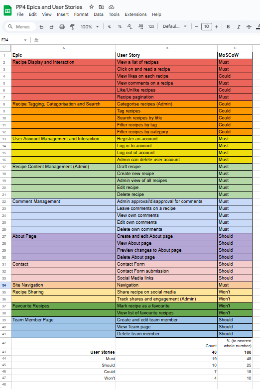

# My Cookbook - Recipe Blog

## Intro

For my fourth portfolio project, I created a blog app to display recipes to a user.  As a private chef, I often get asked by clients to share my recipes with them.  My Cookbook facilitates this as a recipe-sharing app that allows users to browse, search, and interact with recipes - without having to scroll through a lot of text first.

Visit the deployed site here: [My Cookbook](https://pp4-my-cookbook-blog-1667a6d7fc25.herokuapp.com/)

View My Cookbook on [Github](https://github.com/EJFleet/pp4-my-cookbook-blog)

For Admin access with relevant sign-in information: [My Cookbook Admin](https://pp4-my-cookbook-blog-1667a6d7fc25.herokuapp.com/admin/)

---

* [User Experience (UX)](#user-experience-ux)
  * [User Stories](#user-stories)
  * [Design](#design)
    * [Planning](#planning)
    * [Imagery](#imagery)

* [Features](#features)
  * [Future Implementations](#future-implementations)

* [Project Management & Agile Methodologies](#project-management--agile-methodologies)
  * [Kanban Board](#kanban-board)
  * [MoSCoW Prioritisation](#moscow-prioritisation)

* [Technologies Used](#technologies-used)
  * [Languages](#languages)
  * [Frameworks, Libraries & Packages](#frameworks-libraries--packages)
  * [Tools](#tools)

* [Deployment & Local Development](#deployment--local-development)
  * [Forking the GitHub Repository](#forking-the-github-repository)
  * [Cloning the GitHub Repository](#cloning-the-github-repository)
  * [Deploying to Heroku](#deploying-to-heroku)

* [Testing](#testing)
  * [Functionality](#functionality)
  * [Code Validation](#code-validation)
  * [Bug Fixes](#bug-fixes)

* [Credits](#credits)
  * [Code Inspiration](#code-inspiration)
  * [Acknowledgments](#acknowledgments)

---

## User Experience (UX)

The user experience (UX) for this project was designed with careful consideration of user needs and project goals, ensuring a seamless, intuitive, and engaging experience for all users. The planning process was informed by Agile methodologies and centered around user stories, categorized into epics to structure development priorities effectively.

 Epics and User Stories screenshot 

[Link to original document](https://docs.google.com/spreadsheets/d/1zJu0cbOBp-2E82P60fr14d2KqF_FlaW7Y0sWi2PrPls/edit?usp=sharing)

  ### User Stories

  #### Navigation

  As a user I can:
  - use a simple navigation menu so that easily find content.
  - view the navigation menu on any screen sizes so that navigating the site remains easy on all my devices.
  - easily find social media links so that I can find and interact with a community of app users.

  #### User Account

  As a Site User I can:
  - sign up for an account so that I can interact with site content by leaving comments.
  - easily sign in to my account so that I can easily use the site features on return visits.
  - easily log out of my account so that I can keep my account secure.

  As a Site Admin I can:
  - delete a User's account so that I can remove any inappropriate accounts.

  #### Recipe CRUD

    
  As a Staff Member I can:
  - create recipes so that I can share them on the site.
  - save a recipe as a draft so that I can make changes later.
  - publish and unpublish recipes so that I can choose whether to share the recipe or not.
  - update/edit recipes so that I can revise the recipe.
  - delete recipes so that I can remove the recipe from the site.

  #### Site Features

  As a Site User I can:
  - view a paginated list of recipes so that I can select one to read.
  - click on a recipe so that I can read the full recipe.
  - view a list of team members so that I can see who is behind the blog.
  - search for recipe so that I can find the relevant recipe for my needs.

  #### Comment CRUD

  As a Site User I can:
  - view a list of approved comments by registered users so that I can see tips and opinions on each recipe.
  
  As a logged-in Site User I can:
  - leave comments on a recipe so that I can be involved in the conversation.
  - see a notification that my comment is waiting for approval so that I know it has been sent.
  - see my comment displayed just in my view before it has been approved so that I can make any necessary changes.
  - edit my own comments so that I can correct any mistakes.
  - delete my own comments so that I can decide whether I want them to be public any more or not.

  As a Site Admin I can:
  - decide whether to approve or delete a User's comment so that no inappropriate content is displayed on my website.

  #### Team Members

  As a Site Admin I can:
  - create a new Team Member so that I can add a new member of staff as the team grows.
  - edit a Team Member so that I can keep content relevant if someone's details change.
  - delete a Team Member so that I can keep content relevant if somebody leaves. 

### Design

#### Planning

##### Structure

The Recipe Book app is designed with a simple structure to ensure the app is easy to use and navigate. Each page has a consistent layout to allow users to easily find the information they need. The app has a responsive design to ensure it can be clearly viewed on a wide range of devices. The navigation menu is available on all pages of the app to provide users with a consistent method to navigate the site. Bootstrap rows and columns have been used to provide a clean and uniform structure to the content of each page.

##### Wireframes

The wireframes that I originally designed have slightly different aesthetic differences to the finished product. During the construction process, I decided to change the format and layout of some of the features. The original wireframes are below - though the concept evolved, the original layout is still relevant and can be recognised in the finished site.

 base.html - desktop and mobile 

 index.html - desktop and mobile -relevant for both the recipe list and the team page 

recipe_detail.html - desktop

recipe_detail.html - mobile

#### Database Design

The database design for this project consists of the following models:
- **Recipe**: Represents individual recipes.
- **Comment**: Represents comments on recipes.
- **TeamMember**: Represents staff members contributing to the site.

### Database Evolution

The initial Entity Relationship Diagram (ERD) was created during the planning phase to represent the anticipated relationships between the models. However, as development progressed, certain requirements and challenges emerged that led to changes in the database structure. This is a common aspect of Agile development, allowing flexibility to adapt to new insights.

 Current ERD  

  

 Original ERD 

#### Colour Scheme

The colour scheme was chosen to give a fresh, clean look to the app that does not distract from the text and images of the recipes and to provide contrast for good readability of the information. The colour palette was created using [Coolors](https://coolors.co/).

 Colour Palette  

  

#### Fonts
  
[Google Fonts](https://fonts.google.com/) was used to add the following fonts:

- 'Roboto' was used to provide a simple, clean and easy to read appearance.
- 'Nixie One' was used to give character to the logo. 

#### Imagery

- All images used for the recipes were taken from [BBC Good Food](https://bbcgoodfood.com) and [Recipe Tin Eats](https://recipetineats.com).
- All images used for the team members were downloaded for free from [Pexels](https://pexels.com)

  

  
Favicon was created using <a href="https://favicon.io">favicon.io</a>

    
  

  

## Features

  ### Future Implementations

  I would add the following features:
  * Like/remove like from a recipe and view how many likes a recipe had received from other users
  * Recipe categorisation and tagging to facilitate a more comprehensive search and filter experience
  * An 'About' page to explain what the site is about and who it is for
  * Contact Form to make it easier for user's to contact the site admin
  * A share function for a user to share a recipe on social media
  * Users can add a recipe to a 'favourites' folder
  
## Project Management & Agile Methodologies

### Agile Development

This project was developed using Agile methodology which allowed me to iteratively and incrementally build my app, with flexibility to make changes to my design throughout the entire development process.

#### Kanban Board

GitHub Issues and Projects were used to manage the development process. Each part of the app is divided into Epics which are broken down into User Stories with Tasks. An Epic represents a large body of work, such as a feature. The board view of the Project feature was used to display and manage my progress in the form of a 'kanban board'. The user stories were added to the 'Todo' column to be prioritised for development, moved to the 'In Progress' column to indicate development of the feature had begun and finally moved to the 'Done' column when the feature had been implemented and the acceptance criteria had been met.

  
 Kanban Board  

  

[The Project Kanban Board](https://github.com/users/EJFleet/projects/2)

#### MoSCoW Prioritisation

User stories were prioritised using the MoSCoW prioritisation technique. Each user story was given one of the following labels:

- Must have - to indicate the user story is guaranteed to be delivered.
- Should have - to indicate the user story would add significant value but is not vital.
- Could have - to indicate the user story would have a small impact if left out.
- Won't have - to indicate the user story is not a priority in the current iteration.

## Technologies Used

  ### Languages

- [HTML5](https://en.wikipedia.org/wiki/HTML5)
- [CSS3](https://en.wikipedia.org/wiki/CSS)
- [JavaScript](https://en.wikipedia.org/wiki/JavaScript)
- [Python](https://en.wikipedia.org/wiki/Python_(programming_language))

  ### Frameworks, Libraries & Packages
  
- [Django 4.2.16](https://docs.djangoproject.com/en/4.2/) - The main web framework used to build the application, creating models, views and templates.
- [Bootstrap 5](https://getbootstrap.com/) - front-end CSS framework for modern responsiveness and pre-built components
- [Font Awesome 5.15.4](https://fontawesome.com/) - social media icons in footer
- [Google Fonts](https://fonts.google.com/) - fonts used on the app
- [django-crispy-forms](https://django-crispy-forms.readthedocs.io/en/latest/) - enhanced form rendering with customizable styles and better integration with Bootstrap
- [cripsy-bootstrap5](https://github.com/django-crispy-forms/crispy-bootstrap5) - Bootstrap 5 styling support to `django-crispy-forms`
- [django-allauth](https://django-allauth.readthedocs.io/en/latest/) - user authentication, registration, and account management
- [Gunicorn](https://gunicorn.org/) - used for WSGI server
- [psycopg2](https://pypi.org/project/psycopg2/) - PostgreSQL adapter for Python, used to interact with the PostgreSQL database
- [django-summernote](https://summernote.org/) - WYSIWYG text editor integrated into Django admin and forms for creating rich-text content
- [cloudinary 1.36.0](https://cloudinary.com/) - managing and serving images using the Cloudinary API
- [whitenoise (5.3.0)](https://whitenoise.readthedocs.io/en/latest/) - serving static files in production

### Tools

- [Git](https://git-scm.com/) - version control
- [GitHub](https://github.com/) - save and store the files for the app
- [GitPod](https://gitpod.io/) - developing the app
- [Heroku](https://heroku.com/) - deploying the app
- [PostgreSQL](https://www.postgresql.org/) - database
- [Cloudinary](https://cloudinary.com/) - storing images
- [Balsamiq](https://balsamiq.com/) - wireframes
- [Lucid.app](lucid.app) - creating the ERD
- [Coolors](https://coolors.co/) - colour scheme
- [Am I Responsive](https://ui.dev/amiresponsive) -responsive screenshots
- [favicon.io](https://favicon.io/) - custom favicon
- [FontAwesome](https://fontawesome.com/) - social media icons in footer
- [ChatGPT](https://chatgpt.com/) - debugging
- [The W3C Markup Validation Service](https://validator.w3.org/) - validating HTML
- [The W3C CSS Validation Service](https://jigsaw.w3.org/css-validator/) - validating CSS
- [Code Insitute PEP8 Validator](https://pep8ci.herokuapp.com/#) - validating the Python code
- [JSHint](https://jshint.com/) - validating JavaScript
- [Chrome DevTools](https://developer.chrome.com/docs/devtools/)
- [Codebeautify.org](https://codebeautify.org/python-formatter-beautifier) - formatting the code
- [Shields.io](https://shields.io/) - adding badges to the readme
- [Django Secret Key Generator](https://djecrety.ir/) - generating a secret key
- [Pexels](https://www.pexels.com/) - team member photos

##  Deployment & Local Development    

  
### Forking the GitHub Repository

  A copy of the original repository can be made through GitHub. Please follow the below steps to fork this repository.

  

  
Steps for forking GitHub Repository

  1. Navigate to GitHub and log in.  
  2. Once logged in, navigate to this repository using this link [My Cookbook Repository](https://github.com/EJFleet/pp4-my-cookbook-blog).
  3. Above the repository file section and to the top, right of the page is the '**Fork**' button, click on this to make a fork of this repository.
  4. You should now have access to a forked copy of this repository in your Github account.

  

  -----

  ### Cloning the GitHub Repository

  A local clone of this repository can be made on GitHub. Please follow the below steps.

  

  
Steps for cloning GitHub Repository

  1. Navigate to GitHub and log in.
  2. The [My Cookbook Repository](https://github.com/EJFleet/pp4-my-cookbook-blog) can be found at this location.
  3. Above the repository file section, locate the '**Code**' button.
  4. Click on this button and choose your clone method from HTTPS, SSH or GitHub CLI, copy the URL to your clipboard by clicking the '**Copy**' button.
  5. Open your Git Bash Terminal.
  6. Change the current working directory to the location you want the cloned directory to be made.
  7. Type `git clone` and paste in the copied URL from step 4.
  8. Press '**Enter**' for the local clone to be created.

  For more details about forking and cloning a repository, please refer to [GitHub documentation](https://docs.github.com/en/get-started/quickstart/fork-a-repo).

  
 

  ### Deploying to Heroku

  

  
 Deploying to Heroku 

  To get the Django framework installed and set up I followed the Code institutes [Django Blog cheatsheet](https://codeinstitute.s3.amazonaws.com/fst/Django%20Blog%20Cheat%20Sheet%20v1.pdf)

  

  
-----

## Testing

  ### Functionality

  Extensive testing was performed to ensure that the website ran correctly.

    #### Manual Testing

    

  ### Code Validation

  The code was validated using PEP8 standards to ensure readability and maintainability.

  

  
 Validation for  

  

  

  

  
 Validation for  

  

  

  

  
 Validation for  

  

  

  ### Bug Fixes

  |Bug|Solution|Fixed?|
  |-----|-----|-----|
  | |  |  | 

  **There were no other known bugs at the time of submitting the project.**

## Credits

  ### Code Inspiration

  - 
  
    
  ### Acknowledgments

  * My mentor Brian Macharia for his help and clear explanations of what needed to be done
  * Lewis Dillon for facilitating our weekly standups and being a font of information and encouragement
  * My friends and family for testing the project on their devices and offering words of encouragement
  * My dog Po for making me take breaks from my desk